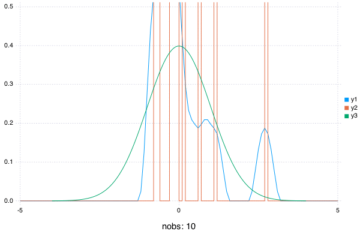

[](http://pkg.julialang.org/?pkg=AverageShiftedHistograms&ver=nightly)
[](https://travis-ci.org/joshday/AverageShiftedHistograms.jl)
[](https://ci.appveyor.com/project/joshday/averageshiftedhistograms-jl/branch/master)
[](https://coveralls.io/r/joshday/AverageShiftedHistograms.jl?branch=master)
[](http://codecov.io/github/joshday/AverageShiftedHistograms.jl?branch=master)

# AverageShiftedHistograms

Density estimation using [Average Shifted Histograms](http://www.stat.rice.edu/~scottdw/stat550/HW/hw4/c05.pdf).


Made with the help of [Plots.jl](https://github.com/tbreloff/Plots.jl):



## Installation:

```julia
Pkg.add("AverageShiftedHistograms")
```

## Differences from `R`'s `ash`:
- It's not written in Fortran
- TODO: timing comparison
- update estimate with new data: `fit!(o, newdata)`
- Change smoothing parameter and/or kernel: `ash!(o; m = 10, kernel = :epanechnikov)`
- Get approximate summary statistics from `UnivariateASH` with `mean(o)`, `var(o)`, `std(o)`, `quantile(o, tau)`
- More kernel options

## Usage

#### Univariate
```julia
o = ash(randn(1000), nbin = 1000)  # 1000 bins by default
o = ash(randn(1000), -4:.1:4)
ash!(o; m = 10, kernel = :gaussian)  # change smoothing parameter to 10 and kernel to gaussian
fit!(o, randn(123))  # include more data

# Get approximate estimates
mean(o)
var(o)
std(o)
quantile(o, .5)
quantile(o, [.25, .5, .75])
pdf(o, 0.0)
nobs(o)  # number of observations in the estimate
nout(o)  # number of observations that fell outside of bins

# Get x and y (density) values
xy(o)
```


#### Bivariate
```julia
x, y = randn(1000), randn(1000) + 3

o = ash(x, y)

# change smoothing parameter for x to 5
# change smoothing parameter for y to 10
# change kernel to x to guassian
# change kernel for y to triweight
ash!(o; mx = 5, my = 10, kernelx = :gaussian, kernely = :triweight)

# include more data
x2, y2 = randn(123), randn(123) + 3
fit!(o, x2, y2)

# Get approximate estimates
nobs(o)
nout(o)
mean(o)
var(o)
std(o)

# get x, y, and z (density) values
xyz(o)
```
