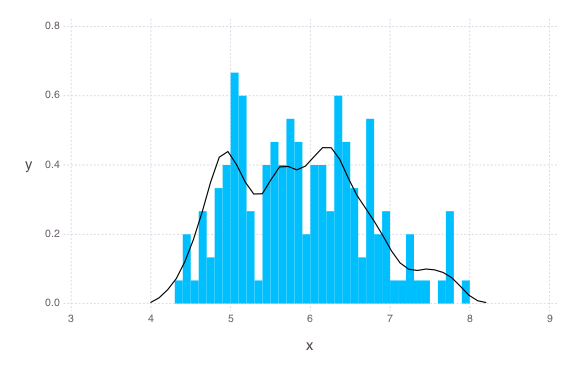

# Univariate Ash Estimator

This example looks at Sepal Length from the Iris dataset in
[RDatasets](https://github.com/johnmyleswhite/RDatasets.jl).


````julia
using AverageShiftedHistograms
using Gadfly
using RDatasets
using DataFrames
````


### Get Data

````julia
iris = dataset("datasets", "iris")
mydata = array(iris[1]) 
````


### Make bins.  Make ash.

````julia
binSepalLength = Bin1(mydata, nbin = 40)  # create bins
ashSepalLength = Ash1(binSepalLength, m = 4, kernel = :biweight)  # create ash
````


### Check fit.

````julia
julia> plot(ashSepalLength, mydata)  # plot estimate over histogram

````





**Note**: For the same `Bin1` object, multiple `Ash1` objects can be made.  It may
be best to try several smoothing parameters `m` and kernels `kernel` to find the
best fit.

### Get Approximate Summary Statistics
````julia
julia> mean(ashSepalLength)
5.840800000000004

julia> var(ashSepalLength)
0.7101594356043964

julia> quantile(ashSepalLength, [.25, .5, .75])
3-element Array{Float64,1}:
 5.182
 5.83 
 6.37 

julia> 
# true values
mean(mydata)
5.843333333333334

julia> var(mydata)
0.6856935123042507

julia> quantile(mydata, [.25, .5, .75])
3-element Array{Float64,1}:
 5.1
 5.8
 6.4

````


