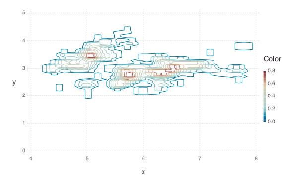

# Bivariate Ash Estimator

This example looks at Sepal Length/Width from the Iris dataset in
[RDatasets](https://github.com/johnmyleswhite/RDatasets.jl).

````julia
using AverageShiftedHistograms
using Gadfly
using RDatasets
using DataFrames
````


### Load packages, iris data.


````julia
iris = dataset("datasets", "iris")
mydata = convert(Array, iris[1:2])  # Get SepalLength, SepalWidth
````


### Make bins.  Make ash.

````julia
bin = Bin2(mydata[:, 1], mydata[:, 2], nbin1 = 50, nbin2 = 50)  # create bins
ash = Ash2(bin, m1 = 3, m2 = 3, kernel1 = :biweight, kernel2 = :gaussian)
````


### Check fit.

````julia
plot(ash)  # plot estimate
````





**Note**: For the same `Bin2` object, multiple `Ash2` objects can be made.  It may
be best to try several smoothing parameters `m1` / `m2` and kernels `kernel1` / `kernel2` to
find the best fit.
