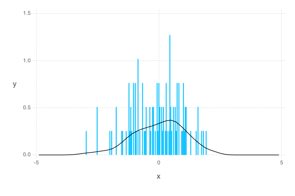
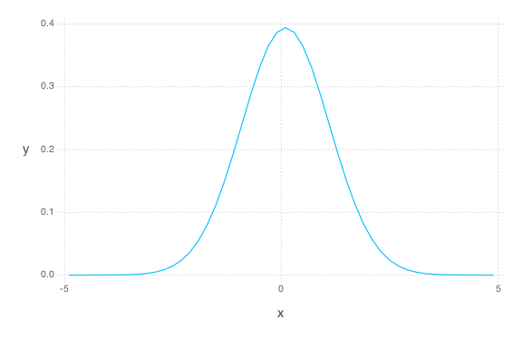

# Univariate `Update!`

````julia
using AverageShiftedHistograms
using Distributions
using Gadfly
````


### First-batch bins and ash estimate
````julia
x = randn(100)
bin = Bin1(x, ab=[-5, 5])
ash = Ash1(bin)
plot(ash, x)
````





### Update bins with many batches
````julia
for i =1:100000
	update!(bin, randn(100))
end

ash = Ash1(bin, m=2)
plot(ash)
````





````julia
julia> mean(ash)
9.930406508172438e-5

julia> var(ash)
1.024539966778512

julia> quantile(ash, [.25, .5, .75])
3-element Array{Float64,1}:
 -0.7
 -0.1
  0.7

julia> 
# true quantiles:
quantile(Normal(), [.25, .5, .75])
3-element Array{Float64,1}:
 -0.67449
  0.0    
  0.67449

````


