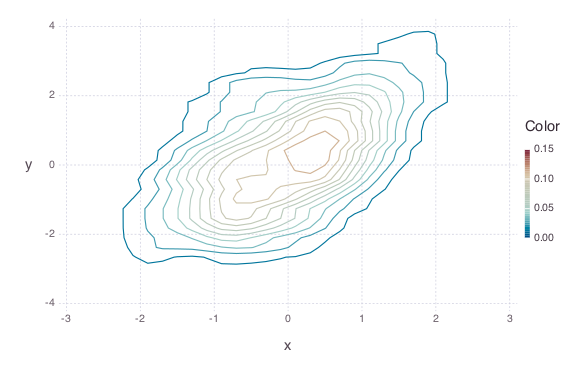
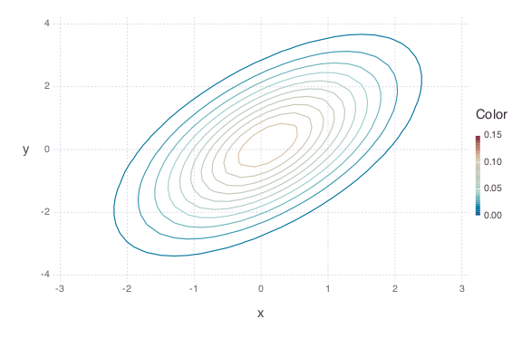

# Bivariate `Update!`

````julia
using AverageShiftedHistograms
using Gadfly
````


### First-batch bins and ash estimate
````julia
x1 = randn(100)
y1 = x1 + randn(100)

bin = Bin2(x1, y1, ab1=[-5, 5], ab2=[-7,7])
ash = Ash2(bin, m1 = 5, m2 = 5)
plot(ash)
````





### Update bins with many batches
````julia
for i = 1:100000
	x = randn(100)
	y = x + randn(100)
	update!(bin, x, y)
end

ash = Ash2(bin, m1 = 2, m2 = 2)
plot(ash)
````



